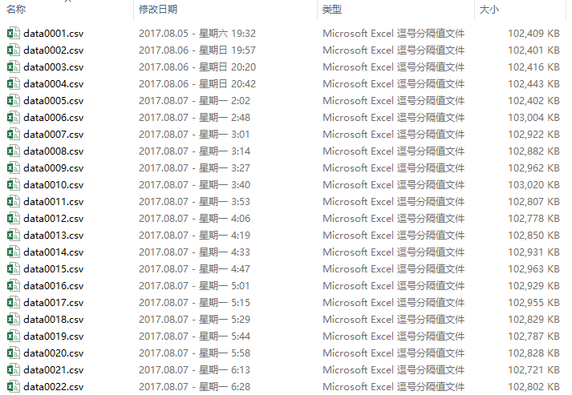
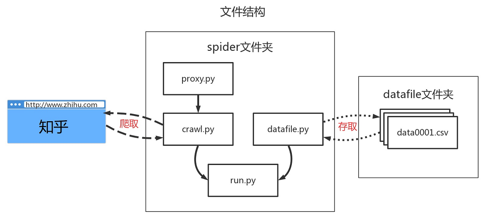
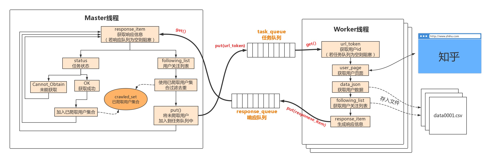
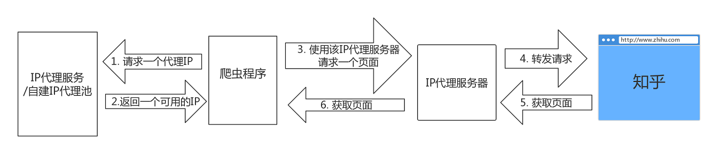
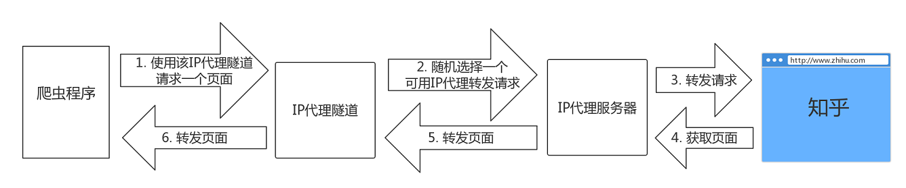
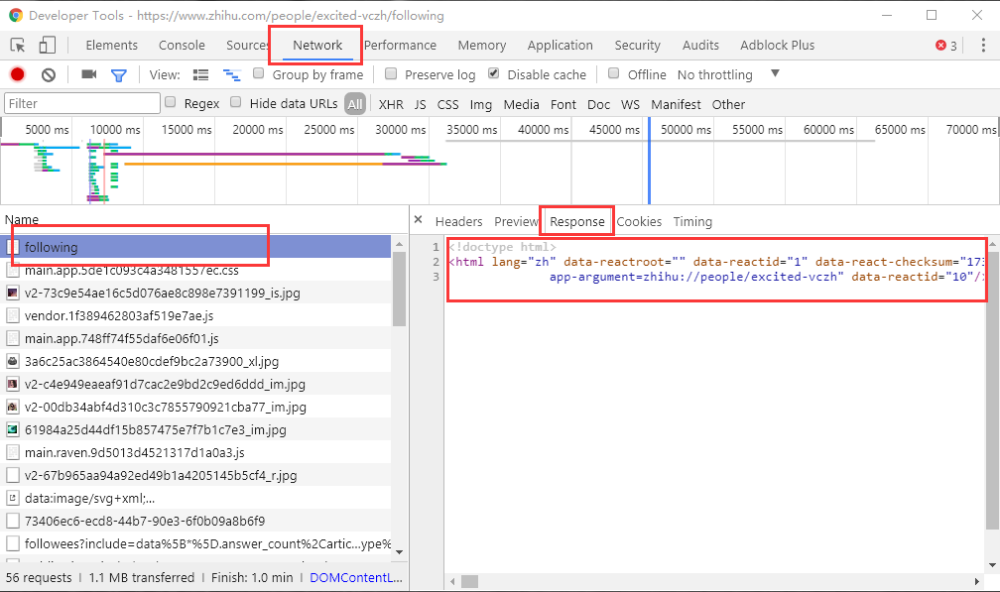
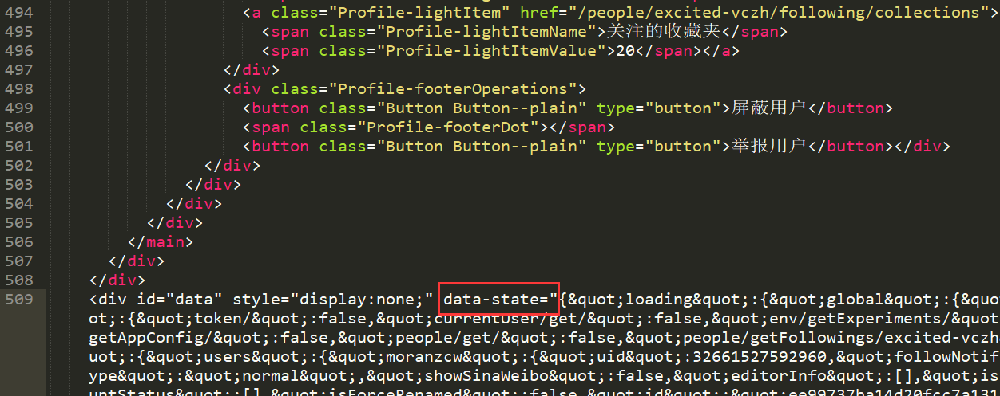
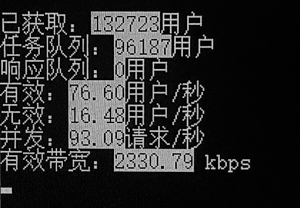

# Zhihu-Spider

一个获取知乎用户主页信息的多线程Python爬虫程序。

简介：

* 使用[Requests](http://www.python-requests.org/en/master/)模拟HTTP请求/响应，[Beautiful Soup 4](https://www.crummy.com/software/BeautifulSoup/)提取页面信息。
* 使用Python内置的Thread多线程和IP代理提升爬取速度，并绕过知乎的反爬虫机制。
* 使用Python内置的query作为消息队列。
* 用csv文件存储数据。

## 环境依赖

* beautifulsoup4
* requests

## 使用方法

在项目路径下输入以安装需要的模块：

```shell
$ pip install -r requirments.txt
```

打开proxy.py文件，在""处填写代理隧道验证信息：

```python
# 代理隧道验证信息
proxyUser = ""
proxyPass = ""
```

（笔者使用一个IP代理隧道，若需要使用普通IP代理，则需要改写getproxies函数，关于代理的细节在后文中详述。）

运行：

```shell
$ python spider/run.py
```

## 数据

运行爬虫一段时间后，将会在项目目录下的datafile文件夹中找到存储数据的csv文件。



每个csv文件100MB，以方便数据分析，同时降低文件意外损坏带来的损失。

数据格式为典型的表格：


第一行为表头，表格一共三列：

1. **第一列为用户的url token**，即用户主页url中的id，如用户vczh的主页链接：https://www.zhihu.com/people/excited-vczh ，那么vczh的token就是excited-vczh，这个token具有唯一性。

2. **第二列为对应用户的数据**，数据是json格式的，因为知乎在页面中是以json来传送用户信息的，所以就直接存储了这个json，Python内置json读写函数，非常方便数据分析。

   以下是整理格式后，用户vczh的部分数据:

   ```json
   {
   	"isFollowed": false, 
   	"educations": 
   		[
   			{
   				"major": 
   					{
   						"url": "http://www.zhihu.com/api/v4/topics/19590324", 
   						"avatarUrl": "https://pic1.zhimg.com/e82bab09c_is.jpg", 
   						"name": "软件学院", 
   						"introduction": "", 
   						"type": "topic", 
   						"excerpt": "", 
   						"id": "19590324"
   					}, 
   				"school": 
   				{
   					"url": "http://www.zhihu.com/api/v4/topics/19599737", 
   					"avatarUrl": "https://pic2.zhimg.com/4d0d193a9_is.jpg", 
   					"name": "华南理工大学（SCUT）", 
   					"type": "topic", 
   					"id": "19599737"
   				}
   			}
   		], 
   	"followingCount": 2263, 
   	"voteFromCount": 0, 
   	"userType": "people", 
   	"showSinaWeibo": false, 
   	"pinsCount": 0, 
   	"isFollowing": false, 
   	"markedAnswersText": "编辑推荐", 
   	"isPrivacyProtected": false, 
   	"accountStatus": [], 
   	"isForceRenamed": false, 
   	"id": "0970f947b898ecc0ec035f9126dd4e08", 
   	"favoriteCount": 1, 
   	"voteupCount": 1388515, 
   	"commercialQuestionCount": 0, 
   	"isBlocking": false, 
   	"followingColumnsCount": 73, 
   	"headline": "专业造轮子，拉黑抢前排。gaclib.net", 
   	"urlToken": "excited-vczh", 
   	"participatedLiveCount": 6, 
   	"followingFavlistsCount": 20, 
   	"isAdvertiser": false, 
   	"isBindSina": true, 
   	"favoritedCount": 236566, 
   	"isOrg": false, 
   	"followerCount": 583782, 
   	"employments": 
   		[
   			{
   				"company": 
   					{
   						"url": "http://www.zhihu.com/api/v4/topics/19557307", 
   						"avatarUrl": "https://pic3.zhimg.com/v2-d3a9ee5ba3a2fe711087787c6169dcca_is.jpg", 
   						"name": "Microsoft Office", 
   						"introduction": "Microsoft Office 是一套由微软开发的办公软件。", 
   					}, 
   				"job": 
   					{
   						"url": "http://www.zhihu.com/api/v4/topics/19578588", 
   						"avatarUrl": "https://pic1.zhimg.com/e82bab09c_is.jpg", 
   						"name": "Developer", 
   						"id": "19578588"
   					}
   			}
   		], 
   	"type": "people", 
   	"avatarHue": "", 
   	"avatarUrlTemplate": "https://pic1.zhimg.com/3a6c25ac3864540e80cdef9bc2a73900_{size}.jpg", 
   	"followingTopicCount": 34, 
   	"avatarUrl": "https://pic1.zhimg.com/3a6c25ac3864540e80cdef9bc2a73900_is.jpg", 
   	"columnsCount": 5, 
   	"hostedLiveCount": 0, 
   	"isActive": 1, 
   	"thankToCount": 0, 
   	"mutualFolloweesCount": 0, 
   	"markedAnswersCount": 4, 
   	"coverUrl": "https://pic1.zhimg.com/v2-67b965aa94a92ed49b1a4205145b5cf4_b.jpg", 
   	"thankFromCount": 0, 
   	"voteToCount": 0, 
   	"isBlocked": false, 
   	"answerCount": 16163, 
   	"allowMessage": false, 
   	"articlesCount": 66, 
   	"name": "vczh", 
   	"questionCount": 487, 
   	"badge": [], 
   	"url": "http://www.zhihu.com/api/v4/people/0970f947b898ecc0ec035f9126dd4e08", 
   	"messageThreadToken": "4874924000", 
   	"logsCount": 2365, 
   	"followingQuestionCount": 26892, 
   	"thankedCount": 176110, 
   	"gender": 1
   }
   ```

   可以看到，用户vczh的大部分基本信息都被包含了。

3. **第三列保存每个用户的关注用户列表**，每个用户只保存20个，此列不用作为数据，只作为爬虫中断后恢复现场和任务队列的用处，分析数据时可以忽略。

## 程序介绍
#### 程序文件结构
程序文件结构如下：



* spider文件夹：爬虫程序文件
  * proxy.py: 包含getproxy()函数，用于获取代理服务器的IP地址和端口，调用一次返回一个代理IP。
  * crawl.py: 包含Crawl类，实现用户页面的获取和用户json信息的提取。
  * datafile.py: 包含DataFile类，实现数据文件的管理和存取。
  * run.py: 程序执行的主要流程，实现了多线程爬虫，其中一个Master线程管理已爬取列表和生成待爬取任务，并响应Worker线程返回的信息；若干Worker线程，数量可设置，用于爬取用户信息并存入数据文件中，同时向Master线程返回一个状态信息。
* datafile文件夹：存储数据文件

#### 程序流程

程序流程如下：



这个爬虫的策略是，选择一个用户作为起始点，获取他的关注列表，加入到任务队列中，作为之后将要爬取的用户，继续获取这些用户的关注列表，去重再加入任务队列，如此循环。把知乎的用户关系看作一个图的话，这个策略类似于广度优先搜索。

至于为什么使用关注列表而不是被关注列表，因为通常每个用户关注的用户都是有效用户，而被关注列表中往往存在三零用户，脚本注册的伪用户等，这类用户通常不被其他用户关注。所以这种策略能高效地筛选出知乎的有效用户。

#### 代理

知乎拥有一定的反爬虫机制。在此案例中，知乎的用户页面不需要登录就能查看，所以需要解决的问题就是IP封锁。笔者简单测试，对于一个IP，每秒一次请求，大约5分钟后就会要求输入验证码，可以说非常严格，所以使用IP代理服务来解决IP封锁的问题。

一般来说，我们有两种解决方案，一种是自己搜集免费代理，建立一个IP代理池，第二种是直接使用付费代理服务。无论哪种，我们的获取代理IP并爬取目标网站的流程大致是这样：



通过IP代理服务请求一个IP，再使用这个IP代理服务器转发请求，获取页面。

笔者使用的IP代理服务略有区别，是一种IP代理隧道，流程大致是这样的：



对于爬虫来说，就省略了一个获取IP的步骤，只需要直接将请求发送到指定的IP代理服务就可以了。

如果需要使用使用上一种通用的IP代理模式，那么只需要再proxy.py中重写getproxies函数就可以了。

#### 用户信息获取

通常一个请求/响应不能加载一个完整页面，所以需要一组请求/响应来完成html文本，JavaScript代码，图片/音频等资源文件的加载。不过这个爬虫案例中，我们在第一次请求/响应中获取的html文档就包含我们需要的所有信息。

以用户vczh为例，其主页为 https://www.zhihu.com/people/excited-vczh ，这个页面下还有anwsers，asks，posts等标签页，我们直接访问following（关注列表）标签页，即 https://www.zhihu.com/people/excited-vczh/following ， 这样一次请求/响应即可同时获得用户信息和用户关注列表。

打开chrome调试工具，查看第一次请求/响应的详细内容：



得到html文本后，在html接近末尾的一个div标签中，有一个data-state属性，它用json存储了信息，我们需要的用户信息和用户关注列表都在其中：



#### 数据存储

数据采用csv文件存储，对于pandas等数据分析工具，csv格式非常方便。

考虑到文件意外损坏的可能性，分多个文件存储，每个文件100MB。

由于程序使用了多线程，所以在存取数据时保证了线程安全。

#### 并发
程序使用多线程来解决网络IO阻塞导致CPU空闲的问题。

由于Python原生解释器的GIL锁，Python的多线程只是在一个CPU上切换运行，而不是在多个CPU上并行运行，所以使用场景有一些限制。换句话说，对于一颗四核心的CPU，一个Python程序实例最高只有25%的占用率。



不过对于此爬虫案例，GIL锁并不是瓶颈，笔者测试，此程序在使用某个付费代理服务时，在200线程的情况下，能保持100请求/s的并发，CPU占用率约在17%-22%（笔记本四核i7），带宽占用不足1MB/s。